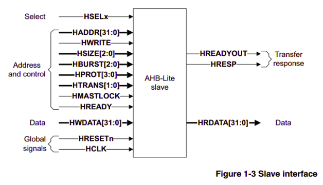

# AHB_Slave_Verification
## Introduction
AMBA AHB-Lite is a bus interface designed for high-performance computer designs. It allows one device to control the communication on the bus and enables fast data transfer.

AHB-Lite incorporates the necessary elements for advanced and fast

* Bursts Transfers
* Operations synchronized with a single clock edge
* Implementation without the use of tristate logic
* Support for wide data bus configurations, 64, 128, 256, 512, and 1024 bits

Internal memory devices, external memory interfaces, and high-speed peripherals are the primary types of AHB-Lite slaves commonly used. While low-speed peripherals can also be connected as AHB-Lite slaves, they are typically connected to the AMBA Advanced Peripheral Bus (APB) for better overall system performance. To facilitate communication between the higher-level AHB-Lite bus and the APB, an AHB-Lite slave called an APB bridge is employed.

In Figure 1-1, a system design is depicted using a single AHB-Lite master and three AHB-Lite slaves. The bus interconnect logic, comprised of an address decoder and a slave-to-master multiplexer, plays a crucial role. The address decoder monitors the master's address to select the appropriate slave, while the multiplexer routes the corresponding slave's output data back to the master.

The key components of an AHB-Lite system are explained as follows:

* **Master** - This component serves as the controlling entity in the system.
* **Slave** - These components are the devices or peripherals that are controlled by the master.
* **Decoder** - This component is responsible for interpreting the address signals from the master and selecting the appropriate slave.
* **Multiplexor** - This component routes the data from the selected slave back to the master.

### Master
An AHB-Lite master is responsible for sending address and control signals to initiate read and write operations. Figure 1-2 illustrates the interface design of an AHB-Lite master.

### Slave
An AHB-Lite slave is responsible for handling transfers initiated by masters within the system. The slave utilizes the HSELx select signal from the decoder to determine when it should respond to a bus transfer. It communicates back to the master to indicate the outcome of the data transfer, whether it was successful, unsuccessful, or if it is waiting for the transfer to complete. Figure 1-3 illustrates the interface design of an AHB-Lite slave.

### Decoder
This particular component interprets the address of every transfer and generates a select signal for the corresponding slave involved in the transfer. Additionally, it supplies a control signal to the multiplexer.

### Multiplexor
To combine the read data bus and response signals from the slaves into a single stream for the master, a slave-to-master multiplexer is necessary. The decoder is responsible for controlling this multiplexer.

### Operation
The initiation of a transfer is carried out by the master through the transmission of address and control signals. These signals convey crucial information such as the address itself, transfer direction, data width, and whether it is part of a burst. Transfers can be categorized as single transfers, incrementing bursts that do not cross address boundaries, or wrapping bursts that wrap around specific address boundaries.
The write data bus facilitates the movement of data from the master to a slave, while the read data bus enables data transfer from a slave to the master.

Each transfer is composed of two phases:

**Address phase:** In this phase, the address and control information are transmitted in a single cycle.

**Data phase:** This phase consists of one or more cycles dedicated to transferring the actual data.

It is important to note that a slave cannot request an extension of the address phase; therefore, all slaves must be capable of sampling the address during this time. However, a slave can request the master to extend the data phase using the HREADY signal. When the HREADY signal is set to LOW, wait states are inserted into the transfer, allowing the slave extra time to provide or sample data.
The success or failure of a transfer is indicated by the slave using the HRESP signal.

## Signal Description

In this chapter, the protocol signals are explained, which are divided into the following sections:

**Global signals:** This section covers the signals that are applicable globally.

**Master signals:** Here, the signals specific to the master component are discussed.

**Slave signals:** This section focuses on the signals associated with the slave component.

**Decoder signals:** The signals related to the decoder component are detailed in this section.

**Multiplexer signals:** Here, the signals pertaining to the multiplexer component are outlined.

### Global Signals

| Name | Source | Description |
| :---         |     :---      |          :--- |
| HCLK   | Clock Source    | The bus clock times all bus transfers. All signal timings are related to the rising edge of HCLK. |
| HRESETn     | Reset Controller       | The bus reset signal is active LOW and resets the system and the bus. This is the only active LOW AHB-Lite signal. |

### Master Signals

| Name | Destination | Description |
| :---         |     :---      |          :--- |
| HADDR[31:0] | Slave | The 32-bit system address bus |
| HBURST[2:0] | Slave | The burst type indicates if the transfer is a single transfer or forms part of a burst. Fixed length bursts of 4, 8, and 16 beats are supported. The burst can be incrementing or wrapping. Incrementing bursts of undefined length are also supported. |
| HPROT[3:0] | Slave | The protection control signals provide additional information about a bus access and are primarily intended for use by any module that wants to implement some level of protection. The signals indicate if the transfer is an opcode fetch or data access, and if the transfer is a privileged mode access or user mode access. For masters with a memory management unit these signals also indicate whether the current access is cacheable or bufferable. |
| HSIZE[2:0] | Slave | Indicates the size of the transfer, that is typically byte, halfword, or word. The protocol allows for larger transfer sizes up to a maximum of 1024 bits. |
| HTRANS[1:0] | Slave | Indicates the transfer type of the current transfer. This can be: IDLE, BUSY, NON SEQUENTIAL, SEQUENTIAL. |
| HWDATA[31:0] | Slave | The write data bus transfers data from the master to the slaves during write operations. A minimum data bus width of 32 bits is recommended. However, this can be extended to enable higher bandwidth operation. |
| HWRITE | Slave | Indicates the transfer direction. When HIGH this signal indicates a write transfer and when LOW a read transfer. It has the same timing as the address signals, however, it must remain constant throughout a burst transfer. |

### Slave Signals

| Name | Destination | Description |
| :---         |     :---      |          :--- |
| HRDATA[31:0] | Multiplexor | During read operations, the read data bus transfers data from the selected slave to the multiplexor. The multiplexor then transfers the data to the master. |
| HREADYOUT | Multiplexor | When HIGH, the HREADYOUT signal indicates that a transfer has finished on the bus. This signal can be driven LOW to extend a transfer. |
| HRESP | Multiplexor | The transfer response, after passing through the multiplexor, provides the master with additional information on the status of a transfer. When LOW, the HRESP signal indicates that the transfer status is OKAY. When HIGH, the HRESP signal indicates that the transfer status is ERROR. |

### Decoder Signals

| Name | Destination | Description |
| :---         |     :---      |          :--- |
| HSELx | Slave | Each AHB-Lite slave has its own slave select signal HSELx and this signal indicates that the current transfer is intended for the selected slave. When the slave is initially selected, it must also monitor the status of HREADY to ensure that the previous bus transfer has completed, before it responds to the current transfer. The HSELx signal is a combinatorial decode of the address bus. |

### Multiplexor Signals
| Name | Destination | Description |
| :---         |     :---      |          :--- |
| HRDATA[31:0] | Master | Read data bus, selected by the decoder. |
| HREADY | Master and Slave | When HIGH, the HREADY signal indicates to the master and all slaves, thatthe previous transfer is complete. |
| HRESP | Master | Transfer response, selected by the decoder |

